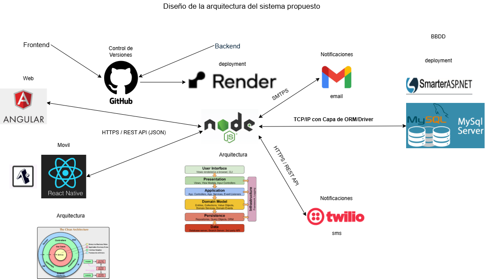
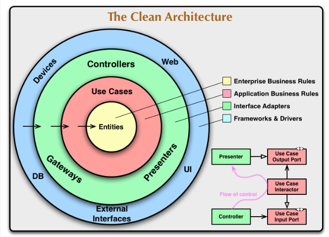

# Frontend App Movil  - Prueba Técnica Etikos 

Este repositorio contiene el cliente Movil (Frontend) del proyecto "Prueba Técnica -Etikos Jardín azuayo". Esta aplicación está desarrollada en **React Native y Expo** e implementa una **Arquitectura Limpia (Clean Architecture)** para garantizar la mantenibilidad y escalabilidad del código.


Esta aplicación consume una API REST desarrollada en Node.js, la cual gestiona la lógica de negocio, la autenticación de usuarios, y la comunicación con servicios de notificación como Gmail y Twilio y la base de datos.

## ✨ Características Principales

* **Autenticación Segura:** Implementación de inicio de sesión con correo y contraseña Las contraseñas se almacenan de forma segura usando Hashing con Bcrypt
* **Autenticación de Doble Factor (2FA):** Los usuarios pueden activar un segundo factor de autenticación. Al iniciar sesión, el sistema solicitará un código OTP enviado por correo electrónico y SMS

## Stack Tecnológico

* **React Native**
* **Expo**
* **TypeScript**
* **Redux (con Redux Toolkit):** Para el manejo del estado global de autenticación.
* **Axios:** Para las peticiones HTTP al backend.
* **React Navigation:** Para la navegación entre pantallas.


## 🚀 Prerrequisitos


### Prerrequisitos

1.  **Node.js** (v18 o superior).
2.  **npm** o **yarn**.
3.  **Expo CLI** (globalmente): `npm install -g expo-cli`.
4.  **Expo Go (App Móvil):** Tener instalada la app "Expo Go" en su dispositivo iOS o Android.
5.  **Backend Corriendo:** El servido debe estar ejecutándose localmente (ej. en `http://localhost:3000`).

## ⚙️ Instalación y Puesta en Marcha


1.  **Clonar el repositorio**

    git clone https://github.com/Jefferson1994/EtikosJeffSvFromAppMovil.git

2.  **Acceder al directorio del proyecto**
    
    cd EtikosJeffSvFromAppMovil


3.  **Instalar dependencias**

    npm install


4.  **Configurar el Entorno**


    Para que la app móvil (en su teléfono) pueda encontrar el servidor (en su PC), no puede usar localhost.Debe usar la       dirección IP de su máquina en la red local.

    Encuentre su IP Local:

    Windows: Abra cmd y escriba ipconfig. Busque su dirección "IPv4 Address" 
    Mac/Linux: Abra una terminal y escriba ifconfig o ip addr. Busque su dirección "inet" 

    **Editar archivo de configuración

    Abra el archivo:
    `src\features\auth\data\repositories\authRepository.ts`

    Luego, reemplace la URL base por su IP local en la variable:

    const API_BASE_URL = 'http://192.168.100.50:3000/user';


    Sustituya 192.168.100.50 por la IP local de su equipo.


5.  **Ejecutar el Servidor de Desarrollo**
    Inicia el servidor de desarrollo local:
    ```bash
    npx expo start
    ```
    Esto abrirá la interfaz de Expo Developer Tools en tu navegador.
    Desde ahí puedes:

    Escanear el código QR con la app Expo Go (en tu teléfono Android o iOS) para abrir la aplicación móvil directamente.

## 🧪 Credenciales de Prueba (Administrador)

Para probar las funcionalidades de administración como bloquear/desbloquear usuarios, puedes utilizar las siguientes credenciales:

* **Email:** `pruebaEtikos1@outlook.com` 
* **Password:** `Etikos12025#` 

### 6. Arquitectura 

Arquitectura General del sistema 




Arquitectura Limpia en  el Frontend Web




---


